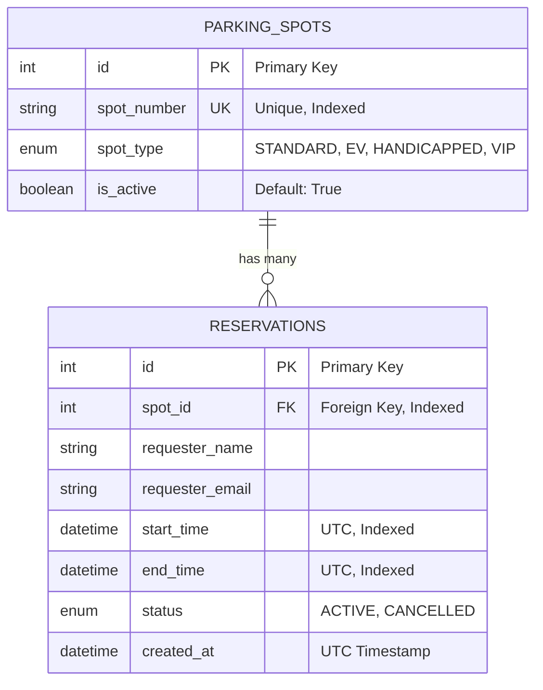
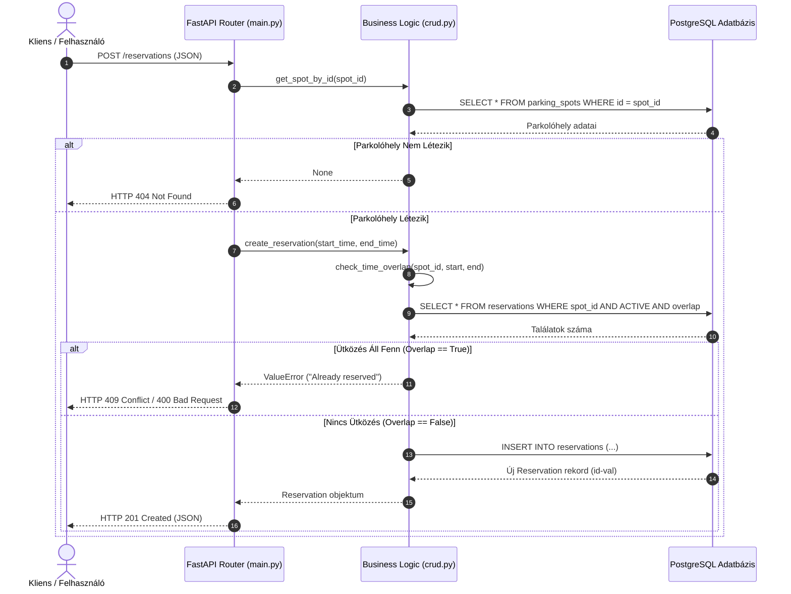

# Rendszerterv

## 1. Rendszer áttekintése
A rendszer egy microservice, REST API alapú parkolóhely foglalásó backend szolgáltatás. A program fő célja a parkolóhelyek nyomon követése, a foglalások felvétele és kezelése, valamint a dupla foglalások megbízható megelőzése.

---

## 2. Architektúra és Technológiai Stakk

A rendszer Layered Architecture felépítést követ, elválasztva az API interfészt, az üzleti logikát és az adatbázis-kezelést:

- **Nyelv és keretrendszer:** Python 3.12 + FastAPI (Magas teljesítmény, automatikus OpenAPI/Swagger dokumentáció)
- **Adatbázis & ORM:** PostgreSQL 16 + SQLAlchemy 2.0 (Relációs adatmodell, tranzakciókezelés, indexelt lekérdezések)
- **Adatvalidáció:** Pydantic v2 (Típusbiztonság, dátum- és e-mail szűrés)
- **Konténerizáció:** Docker & Docker Compose (Egy parancssoros `docker compose up` indítás)
- **Tesztelés:** Pytest + HTTPX (Mértékadó unit- és integrációs tesztszoftver)

---

## 3. Entitás-Kapcsolat Diagram (ER Diagram)

Az alábbi diagram az adatbázis entitásait és azok relációit mutatja be:

---

## 4. Átfedés ellenőrzési Algoritmus 

A rendszer legkritikusabb üzleti logikája a duplafoglalások megelőzése. Két időtartam $[A_{kezd}, A_{vég}]$ és $[B_{kezd}, B_{vég}]$ akkor és csak akkor fedi át egymást, ha:

$$\text{új\_kezdett} < \text{létező\_vég} \quad \text{ÉS} \quad \text{új\_vég} > \text{létező\_kezdett}$$

A szűrés kizárólag az `ACTIVE` státuszú foglalásokat veszi figyelembe. Amennyiben ütközés áll fenn, a rendszer elutasítja a kérést (`HTTP 409 Conflict` / `HTTP 400 Bad Request`).

---

## 5. Folyamat diagram

Az alábbi folyamatábra bemutatja egy új foglalási kérés feldolgozási lépéseit és az áttfedés ellenőrzést:

